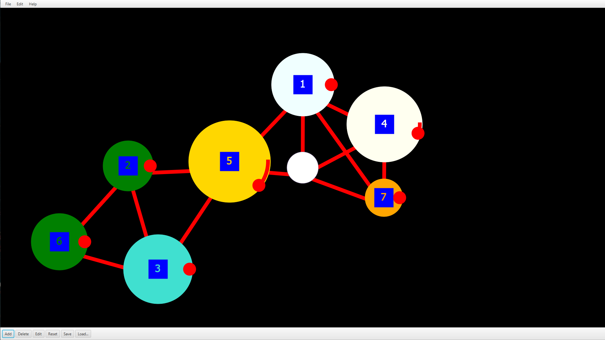

# Intro

Mutli protocol communication hub

Windows (osc/dmx/midi) / Raspberry (osc/dmx) over udp/tcp/usb)

# Concept

Ubq.Reactor let you create pipes with given protocol / communication configuration.

TRANSPORT_PROTOCOL.UDP (udp://)
TRANSPORT_PROTOCOL.TCP (tcp://)
TRANSPORT_PROTOCOL.USB (usb://)
TRANSPORT_PROTOCOL.MIDI (midi:// windows only)
TRANSPORT_PROTOCOL.BT (bt:// windows only / experimental)

currently supported protocols :

Osc, Midi, DMX, Raw (byte[] wrapping without decoding), tuio 1.1

## Udp / Tcp pipes

Datagram / stream sockets based mechanism allowing to connect and bind address/ports.

Listening osc udp pipe : 

Ubq.Reactor.createPipe(TRANSPORT_PROTOCOL.UDP.getLiteral(), "osc", "osc@" + UUID.randomUUID().toString(), "localhost", new int[] {9001}, -1, null, true);

Sending osc tcp pipe :

Ubq.Reactor.createPipe(TRANSPORT_PROTOCOL.TCP.getLiteral(), "osc", "osc@" + UUID.randomUUID().toString(), "localhost:3456", new int[] {}, -1, null, true);

## Usb pipes

Mind to put rxtx libs in your classpath before proceed !

Linux usb connection on /tty/devUSB0

CmdPipe usbTtyUSB0 = mojo.openUsbPipe("dmx", "dmxMood1", "/tty/devUSB0", 115200);

Windows usb connection on COM5 (case sensitive !)

CmdPipe usbCOM5 = mojo.openUsbPipe("dmx", "dmxMood1", "COM5", 115200);

## Midi Pipes (windows only)

Open a connection to Midi synth/sequencer 

CmdPipe midiPipe = Ubq.Reactor.openMidiPipe();
		for (int octave : new int[] { 3, 4, 3, 3, 4, 3, 3, 4, 3, 3, 4, 3, 3, 4, 3 }) {
			for (Integer keyCode : MidiSystemUtils.INSTANCE.getNotes(octave, keys1)) {
				DSLMidiMessage msgON = MidiCmdUtils.INSTANCE.createMidiMessage(ShortMessage.NOTE_ON, (byte) keyCode.intValue(), (byte) 89);
				midiPipe.send(msgON);
			}
		}

# iorx Osc

OscCmd commands are posted when input packet is received and can be be handled with listeners.

OscCmd sent are tranformed into their byte[] form end pushed to listening counter parties.

public class AbletonRcvTest extends GuiceInjectionTest {
	
	private static AbletonRcvTest INSTANCE = new AbletonRcvTest();
	
	public AbletonRcvTest() {
	}

	@Before
	public void init()
	{
	}
	
	public static void main(String[] args) {
		INSTANCE.testOscQxEventsHandling();
		Scanner scanner = new Scanner(System.in);
		String line = "";
		while(!line.equals("stop"))
		{
			 line = scanner.nextLine();
			try {
				Thread.sleep(25l);
			} catch (InterruptedException e) {
				e.printStackTrace();
			}
			scanner.close();
		}
	}
	
	@Test
	public void testOscQxEventsHandling()
	{
		
		CmdPipe pipeIn1 = Ubq.Reactor.createPipe(TRANSPORT_PROTOCOL.UDP.getLiteral(), "osc", "osc@" + UUID.randomUUID().toString(), "localhost", new int[] {9001}, -1, null, true);
		
		pipeIn1.addQxEventHandler(new OSCQxCmdHandler() {
			@Override
			public void handleQxEvent(Event event) {
				if (EVENT_KIND.RX_READY.equals(event.getKind()))
				{
					OscCmd cmd = (OscCmd) event.getCmd();
					System.out.println(((OSCMessage)cmd.getMsg()).getAddress());
				} 
			}
		});

		try {
			Thread.sleep(250l);
		} catch (InterruptedException e) {
			e.printStackTrace();
		}
			
	}
	

}

# iorx DMX

OpenDmxCmd can be dumped as standard DMX byte[] arrays to connected devices such USB DMX controller or UDP Artnet controllers.

It can handle up to 65535 universes in frames.

On raspberry install rxtx first :

$ sudo apt-get install librxtx-java

connect a USB DMX comm (Enttec DMX USB Pro Interface in my case).

Update DmxAppTest.java with correct usb port and led channels.

mvn clean test -P Raspberry -test=DmxAppTest 

	@Test
	public void testDmxFadeToRaimbowOnChannel064Step100()
	{
		String port = "/dev/ttyUSB0";
		
		Ubq mojo = new Ubq();
	
		CmdPipe dmxUsbCom4 = mojo.openUsbPipe("dmx", "dmxMood1", port, 115200);
		
		for (int n=0;n<10;n+=1)
		{
			for (int i=0;i<255;i+=3)
			{
				List<OpenDMXCmd> stack = Lists.newArrayList();
				for (int c=0;c<450;c+=3)
				{
					stack.add(OpenDmxCmdUtils.INSTANCE.createFadeBRG(c+64, i, (c+255-i)%255, (2*i)%255));
				}				
				
				dmxUsbCom4.send(new ByteCmdImpl(OpenDmxCmdUtils.INSTANCE.dumpOpenDMXCmd(stack)));
				
				try {
					Thread.sleep(10l);
				} catch (InterruptedException e) {
					e.printStackTrace();
				}
			}
		}
	}

# iorx Midi

Midi sequencer/synthetiser commands

public class MidiDeviceAndPipesControlTest {

	static Sequencer seq;
	static Transmitter seqTrans;
	static Synthesizer synth;
	static Receiver synthRcvr;
	String[] keys1 = new String[] { "C", "C#", "D", "D#",  "C", "C#", "D", "D#", "C", "C#", "D", "D#",  "C", "C#", "D", "D#" };

	@Before
	public void initSequencer() {
		try {
			seq = MidiSystem.getSequencer();
			seqTrans = seq.getTransmitter();
			synth = MidiSystem.getSynthesizer();
			synth.open();
			synthRcvr = synth.getReceiver();
			seqTrans.setReceiver(synthRcvr);
		} catch (MidiUnavailableException e) {
			e.printStackTrace();
		}
	}

	@Test
	public void testMidiDeviceInit() {

		List<MidiDevice> devices = MidiSystemUtils.INSTANCE.getMidiDevices();

		assertNotNull(devices);
		assertTrue(!devices.isEmpty());

		MidiSystemUtils.INSTANCE.affectInstrumentToChannel(synth, synth.getAvailableInstruments()[10]);
		for (Integer keyCode : MidiSystemUtils.INSTANCE.getNotes(3, keys1)) {
			DSLMidiMessage msgON = MidiCmdUtils.INSTANCE.createMidiMessage(ShortMessage.NOTE_ON,
					(byte) keyCode.intValue(), (byte) 89);
			if (msgON != null) {
				MidiChannel[] channels = synth.getChannels();
				if (channels != null && channels[msgON.getChannel()] != null) {
					channels[msgON.getChannel()].allNotesOff();
					channels[msgON.getChannel()].noteOn((int) msgON.getByte1(), (int) msgON.getByte2());
					try {
						Thread.sleep(75);
					} catch (InterruptedException e) {
						e.printStackTrace();
					}
				}
			}
		}

	}

	@Test
	public void testMidiCmdPipe() {
		CmdPipe midiPipe = Ubq.Reactor.openMidiPipe();
		for (int octave : new int[] { 3, 4, 3, 3, 4, 3, 3, 4, 3, 3, 4, 3, 3, 4, 3 }) {
			for (Integer keyCode : MidiSystemUtils.INSTANCE.getNotes(octave, keys1)) {
				DSLMidiMessage msgON = MidiCmdUtils.INSTANCE.createMidiMessage(ShortMessage.NOTE_ON, (byte) keyCode.intValue(), (byte) 89);
				midiPipe.send(msgON);
			}
		}
	}

# iorx.ui

RX IO queues and multitouch UI

Multitouch OSC UI alpha demo :

https://github.com/lucascraft/iorx/blob/master/iorx.ui-0.0.1-SNAPSHOT-with-dependencies.zip

Mouse and/or multitouch OSC controller aiming at manipulating nodes and connections in a graph like organization.

Each event (move, add, remove, connect, disconnect) emits OSC messages to port 4447

A chuck file is provided for additive frequency synthesis demo

It is mandatory to download chuck VM and/or editor separatly in order to get the demo working :

http://audicle.cs.princeton.edu/mini/

To proceed :

1) unzip the iorx.ui-0.0.1-SNAPSHOT-with-dependencies.zip archive
2) execute launch.bat
3) open fmurfOsc.ck into miniAudicle editor
3) Launch chuck VM
4) Add Shred to VM (Plus button)
5) play
6) hack
7) goto (5) : until statified or fail : goto youtube 

